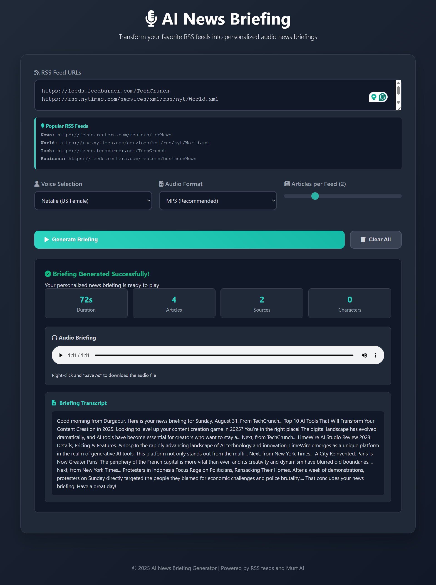

# 🎙️ AI News Briefing Generator

Transform your favorite RSS feeds into personalized, professional audio news briefings with background music and customizable voices.

## 📸 Screenshots

### Main Interface


*Clean, dark-themed interface for configuring news briefing*

### Generated Briefing


*Audio player and transcript view after successful generation*

## ✨ Features

- **RSS Feed Integration**: Support for multiple RSS feeds from popular news sources
- **Professional Voice Generation**: Powered by Murf AI with multiple voice options
- **Audio Enhancement**: Automatic background music mixing for professional sound
- **Customizable Briefings**: Adjust article count, voice selection, and audio format
- **Dark Theme UI**: Modern, responsive web interface
- **Real-time Processing**: Live feedback during briefing generation
- **Multiple Formats**: Export as MP3, WAV, or FLAC
- **Auto-save**: Remembers your preferred RSS feeds

## 🎯 Use Cases

- **Daily News Consumption**: Convert your morning news reading into audio briefings
- **Commute Companion**: Listen to personalized news during travel
- **Accessibility**: Audio-first news consumption for visually impaired users
- **Productivity**: Multitask while staying informed
- **Content Creation**: Generate news summaries for podcasts or broadcasts

## 🚀 Quick Start

### Prerequisites

- Python 3.8+
- FFmpeg (for audio processing)
- Murf AI API key ([Get one here](https://murf.ai/))

### Installation

1. **Clone the repository**

   ```bash
   git clone https://github.com/WizOctavius/news-brief.git
   cd news-brief
   ```

2. **Install dependencies**

   ```bash
   pip install -r requirements.txt
   ```

3. **Setup FFmpeg**

   **Windows:**
   - Download FFmpeg from [https://ffmpeg.org/download.html](https://ffmpeg.org/download.html)
   - Extract to `C:\ffmpeg\`
   - Or ensure `ffmpeg.exe` is in your PATH

   **macOS:**

   ```bash
   brew install ffmpeg
   ```

   **Linux (Ubuntu/Debian):**

   ```bash
   sudo apt update
   sudo apt install ffmpeg
   ```

4. **Configure Murf API**
   - Open `main.py`
   - Replace `PASTE_YOUR_API_KEY_HERE` with your actual Murf API key:

   ```python
   MURF_API_KEY = "your_actual_murf_api_key_here"
   ```

5. **Add Background Music (Optional)**
   - Place your background music file as `assets/corporate-technology-196202.mp3`
   - Or update the `BACKGROUND_MUSIC_PATH` variable in `main.py`

6. **Run the application**

   ```bash
   python main.py
   ```

7. **Access the web interface**
   - Open your browser to `http://localhost:8000`
   - API documentation available at `http://localhost:8000/docs`

## 🛠️ Project Structure

```bash
ai-news-briefing-generator/
├── main.py                 # FastAPI backend server
├── static/
│   ├── index.html         # Web interface
│   ├── script.js          # Frontend JavaScript
│   └── generated_audio/   # Generated audio files (auto-created)
├── assets/
│   └── corporate-technology-196202.mp3  # Background music
├── requirements.txt       # Python dependencies
└── README.md             # This file
```

## 🎛️ Configuration Options

### Voice Selection

- **Natalie** (US Female) - Default
- **Wayne** (US Male)
- **Hazel** (UK Female)
- **Nolan** (UK Male)

### Audio Formats

- **MP3** - Recommended for most use cases
- **WAV** - High quality, larger file size
- **FLAC** - Lossless compression

### Articles per Feed

- Adjustable from 1-5 articles per RSS feed
- Total briefing limited to 20 articles maximum

## 📰 Supported RSS Feeds

The application works with any valid RSS feed. Popular examples include:

- **Reuters**: `https://feeds.reuters.com/reuters/topNews`
- **New York Times**: `https://rss.nytimes.com/services/xml/rss/nyt/World.xml`
- **TechCrunch**: `https://feeds.feedburner.com/TechCrunch`
- **BBC News**: `http://feeds.bbci.co.uk/news/rss.xml`
- **Reuters Business**: `https://feeds.reuters.com/reuters/businessNews`

## 🔧 API Reference

### Generate Briefing

```http
POST /generate-briefing
```

**Request Body:**

```json
{
  "feeds": [
    "https://feeds.reuters.com/reuters/topNews",
    "https://rss.nytimes.com/services/xml/rss/nyt/World.xml"
  ],
  "voice_id": "en-US-natalie",
  "audio_format": "MP3",
  "max_articles_per_feed": 3
}
```

**Response:**

```json
{
  "success": true,
  "audio_url": "/static/generated_audio/briefing_abc123.mp3",
  "briefing_text": "Good morning from Durgapur...",
  "audio_length_seconds": 180.5,
  "characters_used": 1250,
  "characters_remaining": 8750,
  "articles_count": 6,
  "sources": ["Reuters", "New York Times"]
}
```

### Health Check

```http
GET /health
```

Returns system status including API configuration and FFmpeg availability.

## 🎵 Background Music

The application automatically mixes speech with background music for a professional podcast-like experience. The background music is:

- Automatically looped to match speech duration
- Volume-adjusted to not interfere with speech clarity
- Mixed using FFmpeg for optimal audio quality

If no background music is provided, the application gracefully falls back to speech-only audio.

## 🔒 Environment Variables

```bash
MURF_API_KEY=your_murf_api_key_here
```

## 🐛 Troubleshooting

### Common Issues

#### **"FFmpeg not found" warning**

- Ensure FFmpeg is properly installed and accessible
- Check that FFmpeg executable is in your system PATH
- On Windows, verify the installation path matches the expected locations

#### **"Murf API key is not configured"**

- Verify your API key is correctly set in `main.py`
- Ensure the key is valid and has sufficient credits
- Check Murf API documentation for authentication requirements

#### **"Could not connect to the server"**

- Ensure the FastAPI server is running on port 8000
- Check for any firewall or antivirus blocking the connection
- Verify Python dependencies are properly installed

#### **No articles found**

- Verify RSS feed URLs are valid and accessible
- Check that feeds contain recent articles
- Some feeds may require specific headers or user agents

## 🤝 Contributing

1. Fork the repository
2. Create a feature branch (`git checkout -b feature/amazing-feature`)
3. Commit your changes (`git commit -m 'Add amazing feature'`)
4. Push to the branch (`git push origin feature/amazing-feature`)
5. Open a Pull Request

## 📋 Roadmap

- [ ] Support for podcast RSS feeds
- [ ] Multiple language support
- [ ] Scheduled briefing generation
- [ ] Email delivery integration
- [ ] Custom intro/outro messages
- [ ] Advanced audio effects and processing
- [ ] Mobile app companion

## 🙏 Acknowledgments

- [Murf AI](https://murf.ai/) for text-to-speech capabilities
- [FastAPI](https://fastapi.tiangolo.com/) for the robust web framework
- [Feedparser](https://feedparser.readthedocs.io/) for RSS feed parsing
- [Pydub](https://github.com/jiaaro/pydub) for audio processing

## 📞 Support

If you encounter any issues or have questions:

1. Check the 🐛 Troubleshooting section
2. Review the API documentation at `http://localhost:8000/docs`
3. Open an issue on GitHub with detailed error information

---

### **Made with ❤️ for news enthusiasts who prefer audio content.**
